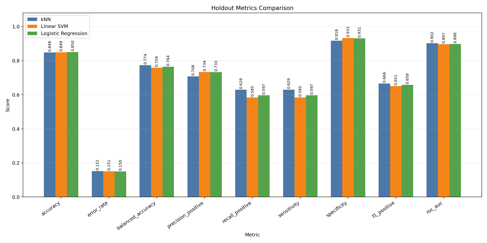

# Income Classification with the Adult Dataset

Machine learning project for annual income classification on the **Adult Income** dataset, comparing three supervised learning approaches under the same experimental protocol:

- k-Nearest Neighbors (kNN)
- Linear Support Vector Machine (SVM)
- Logistic Regression

The goal was to build a fair and educational comparison: all models use the same prepared dataset, the same feature set, the same development/holdout split, the same cross-validation protocol, and the same selection metric.

## Table of Contents

- [Objective](#objective)
- [What Was Done](#what-was-done)
- [Results](#results)
- [Key Insights](#key-insights)
- [Additional Materials](#additional-materials)
- [Project Structure](#project-structure)
- [How to Run](#how-to-run)
- [Reproducibility](#reproducibility)
- [Contributing](#contributing)
- [License](#license)

## Objective

This project investigates how different classifiers behave when predicting whether a person belongs to the `>50K` or `<=50K` income class.

Instead of focusing only on overall accuracy, the analysis also considers metrics that matter for imbalanced datasets, such as `balanced accuracy`, positive-class `recall`, `specificity`, `F1`, and `ROC AUC`.

## What Was Done

The full workflow was organized into notebooks:

1. **Data quality diagnosis**
   - Inspected missing values, duplicates, distributions, and inconsistencies.
   - Identified safe decisions for cleaning and feature engineering.

2. **Data preparation**
   - Conservatively removed exact duplicate rows with the same target.
   - Preserved conflicting duplicate groups for diagnosis.
   - Created `log1p` transformed variables for highly skewed columns.
   - Created missingness indicators for categorical variables.
   - Exported prepared artifacts to `data/prepared/adult_income/`.

3. **kNN modeling**
   - Built the first complete baseline.
   - Tuned `k`, `weights`, and distance parameter `p`.
   - Evaluated on a local holdout split and generated a submission file.

4. **Linear SVM modeling**
   - Compared the baseline against a regularized linear classifier.
   - Tuned the `C` parameter.
   - Evaluated with the same protocol used for kNN.

5. **Logistic Regression modeling**
   - Added a probabilistic, interpretable model aligned with classical classification theory.
   - Tuned the `C` parameter.
   - Consolidated the final comparison across the three models.

## Results

The final comparison is saved in:

- `submissions/knn_vs_svm_vs_logreg_holdout_comparison.csv`
- `submissions/knn_vs_svm_vs_logreg_holdout_metrics.png`



| Model | Accuracy | Balanced accuracy | Positive precision | Positive recall | Specificity | Positive F1 | ROC AUC |
|---|---:|---:|---:|---:|---:|---:|---:|
| kNN | 0.84819 | 0.77354 | 0.70803 | 0.62946 | 0.91761 | 0.66644 | 0.90215 |
| Linear SVM | 0.84880 | 0.75871 | 0.73360 | 0.58482 | 0.93259 | 0.65082 | 0.89723 |
| Logistic Regression | 0.85049 | 0.76396 | 0.73297 | 0.59694 | 0.93097 | 0.65800 | 0.89756 |

Summary:

- **Best overall accuracy:** Logistic Regression
- **Best balanced accuracy:** kNN
- **Best positive precision:** Linear SVM
- **Best positive recall/sensitivity:** kNN
- **Best specificity:** Linear SVM
- **Best positive F1:** kNN
- **Best ROC AUC:** kNN

## Key Insights

There is no single "best model" without first defining the success criterion.

**Logistic Regression** achieved the highest overall holdout accuracy, making it a strong choice when the main goal is global performance with good interpretability.

**kNN** performed best on metrics that are more sensitive to the positive class `>50K`, with the best `balanced accuracy`, `recall`, `F1`, and `ROC AUC`. This suggests a better ability to recover examples from the minority class.

**Linear SVM** was the most conservative model: it achieved the highest positive `precision` and `specificity`, making fewer mistakes when predicting the `>50K` class, but missing more positive cases.

The biggest methodological gain came from standardization: preparing the data once, selecting a shared feature set, and evaluating every model with the same protocol reduced comparison bias.

## Additional Materials

The repository also includes complementary project documentation:

- [Implementation report](RELATORIO_IMPLEMENTACAO.md): a technical summary of the implemented workflow, modeling decisions, and final comparison.
- [Project report PDF](<atividade_aprendizado_estatistico_adults_dataset (3).pdf>): attached report version for review or submission.

## Project Structure

```text
.
|-- data/
|   |-- adult-pmr3508/                 # Original competition data
|   `-- prepared/adult_income/         # Prepared data and artifacts
|-- notebooks/
|   |-- 01_data_quality_diagnosis.ipynb
|   |-- 02_data_preparation.ipynb
|   |-- 03_knn_classifier.ipynb
|   |-- 04_svm_classifier.ipynb
|   `-- 05_logistic_regression_classifier.ipynb
|-- scripts/
|   `-- plot_holdout_comparison.py
|-- submissions/                       # Metrics, parameters, plots, and submissions
|-- RELATORIO_IMPLEMENTACAO.md
|-- atividade_aprendizado_estatistico_adults_dataset (3).pdf
|-- requirements.txt
`-- README.md
```

## How to Run

### 1. Clone the repository

```bash
git clone <repository-url>
cd classifier-adults-dataset
```

### 2. Create and activate a virtual environment

```bash
python -m venv .venv
source .venv/bin/activate
```

On Windows:

```bash
.venv\Scripts\activate
```

### 3. Install dependencies

```bash
pip install -r requirements.txt
```

### 4. Open the notebooks

```bash
jupyter lab
```

Run the notebooks in this order:

1. `notebooks/01_data_quality_diagnosis.ipynb`
2. `notebooks/02_data_preparation.ipynb`
3. `notebooks/03_knn_classifier.ipynb`
4. `notebooks/04_svm_classifier.ipynb`
5. `notebooks/05_logistic_regression_classifier.ipynb`

The original data and prepared artifacts are already versioned in this project. To rebuild everything from scratch, start with notebooks `01` and `02`; to study only the models, notebooks `03`, `04`, and `05` already consume the prepared files from `data/prepared/adult_income/`.

### 5. Regenerate the comparison plot

After running the modeling notebooks, execute:

```bash
python scripts/plot_holdout_comparison.py
```

The consolidated plot will be updated at:

```text
submissions/knn_vs_svm_vs_logreg_holdout_metrics.png
```

## Reproducibility

The experimental protocol used by the models was:

- Stratified split of the labeled training data:
  - 80% for development and cross-validation.
  - 20% for local holdout evaluation.
- Cross-validation with `StratifiedKFold`, 5 folds, `shuffle=True`, and `random_state=42`.
- Hyperparameter selection by `accuracy`.
- Holdout used only once for final local evaluation.
- Competition test data used only to generate submission files.

The main artifacts saved in `submissions/` include:

- `knn_best_params.json`
- `svm_best_params.json`
- `logreg_best_params.json`
- `knn_holdout_metrics.json`
- `svm_holdout_metrics.json`
- `logreg_holdout_metrics.json`
- `knn_submission.csv`
- `svm_submission.csv`
- `logreg_submission.csv`

## Contributing

Contributions are welcome. To keep the project organized:

1. Open an issue describing the idea, bug, or improvement.
2. Create a branch with a descriptive name.
3. Keep changes small and reviewable.
4. Update notebooks, scripts, and documentation when needed.
5. Record before/after metrics if the contribution affects modeling.

Good next improvements would include testing tree-based models, probability calibration, decision threshold tuning, and feature-importance interpretability.

## License

This repository does not yet declare a formal license. Before reusing the code or artifacts in another context, add a `LICENSE` file that matches the intended use.
